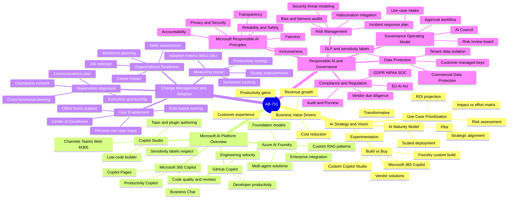
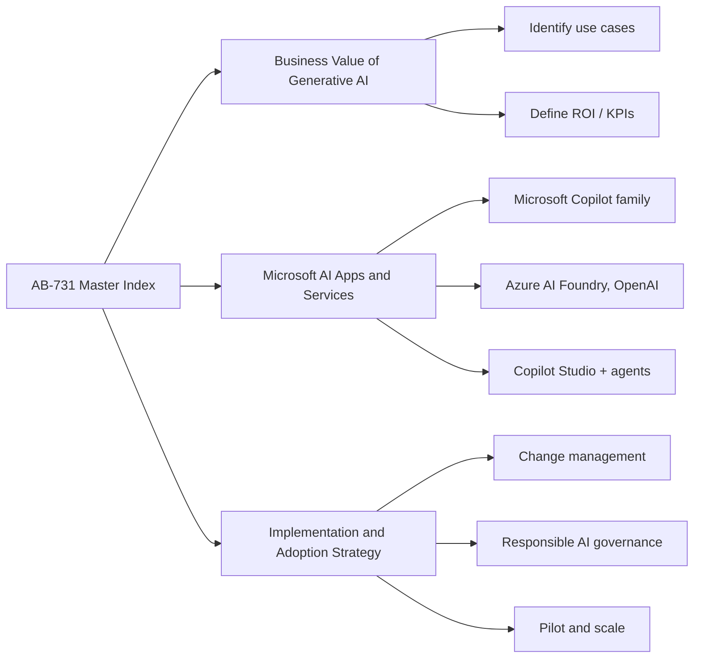
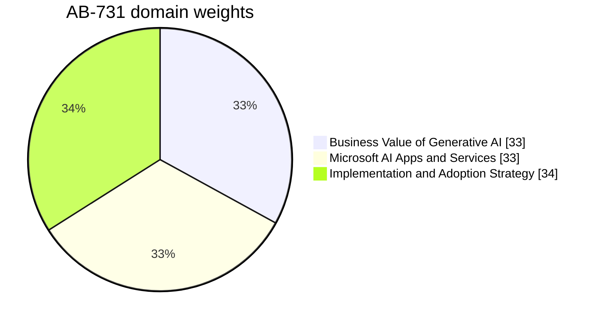

# AB-731 - Microsoft Certified: AI Transformation Leader - Visual Study Guide

> Concept-only study aid. No exam questions reproduced. Source PDF (if any) stays local + gitignored.

**Skills outline:** https://learn.microsoft.com/credentials/certifications/ai-transformation-leader/

## Audience

AB-731 is for **leaders and decision-makers** - not developers, not end users - who need to:
- Identify business problems where generative AI delivers measurable value.
- Understand Microsoft's AI portfolio at a strategic level (what each product does and who uses it).
- Lead enterprise AI adoption: change management, governance, ROI, responsible AI.

This is the strategic complement to AB-730 (which is for the daily user).

## The 4 Exam Domains - Mind Map

## Domain map

## Domain weights

## Recommended study order

```mermaid
gantt
    title Suggested study plan
    dateFormat X
    axisFormat Day %d
    section Plan
    Business Value :t1, 0, 1d
    Microsoft AI Apps and Services :t2, after t1, 2d
    Implementation and Adoption Strategy :t3, after t2, 2d
```

## Top 12 things to know

1. **Generative AI value** comes in three buckets: productivity, customer experience, new revenue.
2. **ROI** is measured by minutes saved per task, deflection rate (support), revenue per AI feature.
3. **Microsoft Copilot family** has 3 tiers: Microsoft Copilot (free, web), Microsoft 365 Copilot (work), and role-specific Copilots (Sales, Service, Finance).
4. **Copilot Studio** lets makers build custom Copilot agents on top of organizational data.
5. **Azure AI Foundry** is the developer + IT pro platform (Azure OpenAI models, prompt flow, evaluations).
6. **GitHub Copilot** is a separate developer-targeted product.
7. **Responsible AI governance** - Microsoft's six principles plus organizational policies (Responsible AI Standard, Impact Assessments).
8. **Change management** is the #1 success factor in adoption. Champions, training, prompt libraries.
9. **Pilot to scale** pattern: pick high-value, low-risk use cases first; measure; expand.
10. **Data readiness** matters: Microsoft Graph quality, sensitivity labels, oversharing remediation.
11. **Privacy** - M365 Copilot does NOT use your tenant data to train base models.
12. **Cost** - M365 Copilot is per-user; Azure AI is consumption-based.

## Common gotchas

- "AI strategy" without measurable KPIs fails - start with one clear KPI per use case.
- Pilot without champions stalls.
- Oversharing in SharePoint can leak data through Copilot - Purview labels and access reviews matter.
- Free Microsoft Copilot is NOT the same as Microsoft 365 Copilot for governance purposes.
- AI investments without responsible AI governance create regulatory and reputational risk.

## Supporting pages

- [05-exam-cheatsheet.md](05-exam-cheatsheet.md)
- [06-references.md](06-references.md)
- [07-extra-ab731-concepts.md](07-extra-ab731-concepts.md)
- [08-learn-summaries.md](08-learn-summaries.md)
- [09-arch-ab731.md](09-arch-ab731.md)
- [11-microsoft-resources.md](11-microsoft-resources.md)
- [12-glossary.md](12-glossary.md)
- [13-flashcards.md](13-flashcards.md)
- [14-pitfalls.md](14-pitfalls.md)
- [15-hands-on-labs.md](15-hands-on-labs.md)
- [16-architecture-center.md](16-architecture-center.md)
- [17-copilot-quiz.md](17-copilot-quiz.md)
- [99-practice-assessment.md](99-practice-assessment.md)
- [99-video-tutorials.md](99-video-tutorials.md)

---

**Next:** open [01-business-value.md](01-business-value.md)
