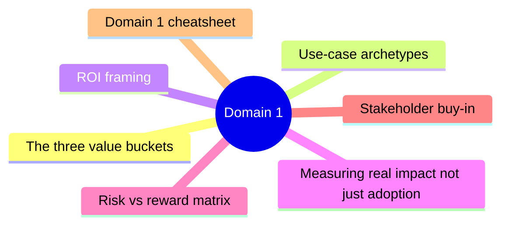
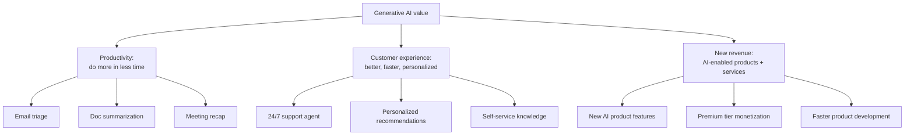
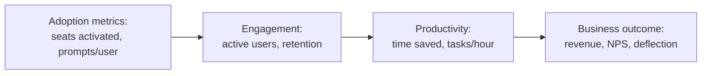
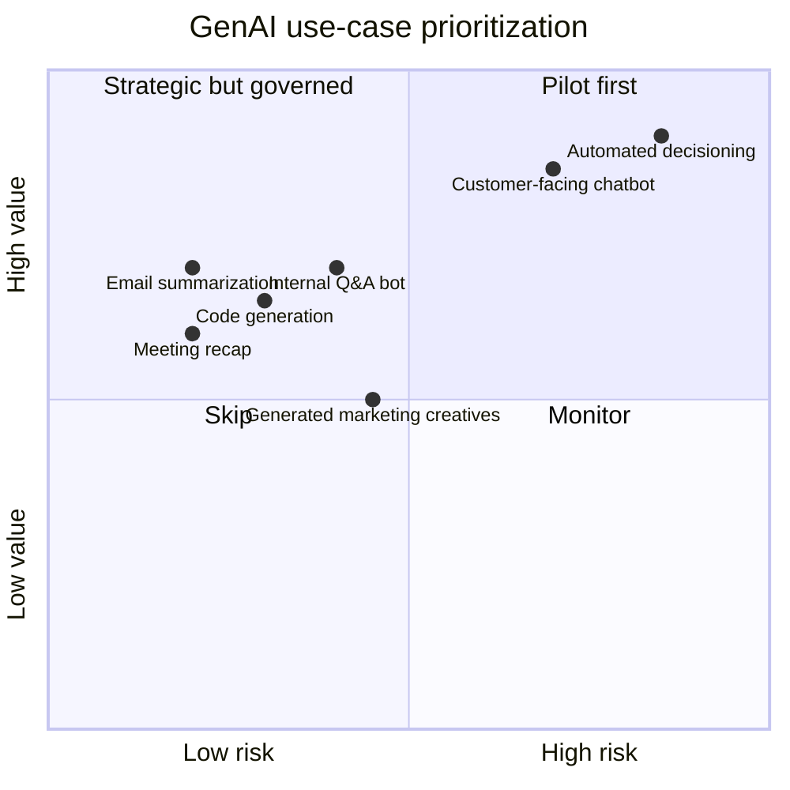

# Domain 1: Business Value of Generative AI Solutions

> How to identify, frame, and measure business value from generative AI.

## Domain mind map

## The three value buckets

## Use-case archetypes

| Archetype | Example | KPI |
|---|---|---|
| **Drafting / authoring** | Sales proposals, marketing emails | Time saved per draft |
| **Summarization** | Meeting recaps, research digests | Time saved per consumption |
| **Knowledge search** | Find a policy / FAQ across SharePoint | Self-service deflection rate |
| **Q&A bot** | Customer support, internal HR | Cost per ticket; CSAT |
| **Translation** | Localized content | Translation cost; time-to-launch |
| **Code generation** | Developer productivity | PRs / dev / week; cycle time |
| **Image generation** | Marketing creatives | Cost per asset |
| **Decision support** | Pricing recommendations | Conversion uplift |

## ROI framing

A simple business case has three numbers:

| Variable | Source |
|---|---|
| **Time saved** per user per week | Pilot measurement, e.g. "30 min/week from email triage" |
| **Hourly cost** of user | HR loaded cost |
| **License cost** per user (M365 Copilot is per-user/month) | Microsoft pricing |

ROI = (time_saved * hourly_cost - license_cost) * users.

## Measuring real impact (not just adoption)

- Adoption alone is **vanity** - measure productivity and outcome.
- Microsoft 365 Copilot Dashboard tracks adoption; pair it with surveys + workflow telemetry.

## Risk vs reward matrix

**Pilot first** = high value, low risk (top-left). **Strategic but governed** = high value, high risk (top-right) - needs robust governance.

## Stakeholder buy-in

| Stakeholder | What they care about | Talking point |
|---|---|---|
| CEO / Board | Revenue, competitive position, risk | "AI moats and customer experience differentiation" |
| CFO | ROI, payback period | "License cost vs. measured productivity uplift" |
| CIO | Security, integration, supportability | "Microsoft 365 Copilot honors existing identity, sensitivity, audit" |
| CISO | Privacy, data exfil, compliance | "M365 Copilot data is in your tenant; no foundation-model training; Purview labels propagate" |
| HR | Change management, jobs | "Augmentation vs. automation; reskilling plan" |
| Legal | IP, copyright, regulation | "Microsoft Copyright Commitment; EU AI Act readiness" |
| Line-of-business | Workflow fit | "Use cases mapped to KPIs they already own" |

## Domain 1 cheatsheet

| Wording | Answer |
|---|---|
| "value bucket: doing existing work faster" | Productivity |
| "value bucket: better customer experience" | Customer experience / engagement |
| "value bucket: new product / monetization" | New revenue |
| "metric for adoption alone" | Vanity (use productivity / outcome) |
| "where to start" | High value + low risk |
| "Microsoft IP indemnification for Copilot output" | Microsoft Copyright Commitment |

---

**Next:** open [02-microsoft-ai-apps.md](02-microsoft-ai-apps.md)
