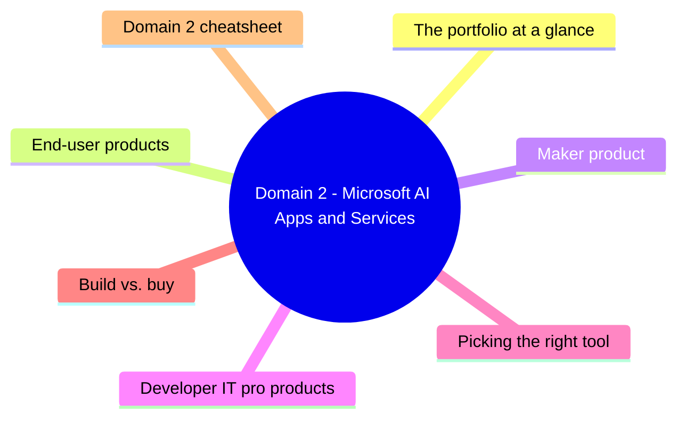
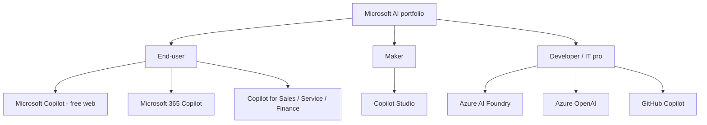
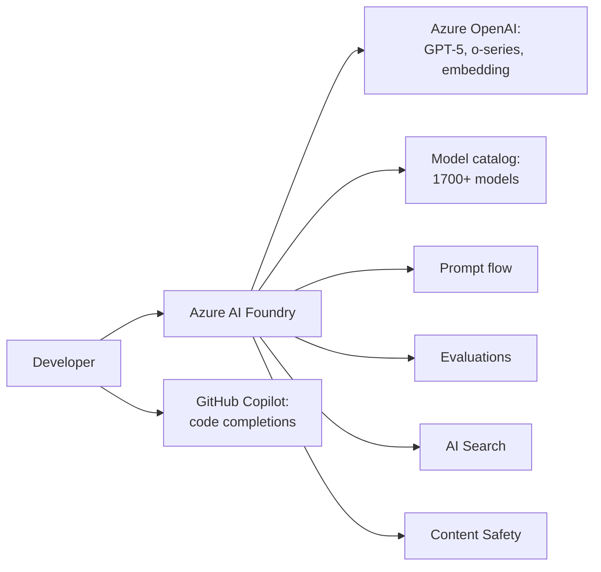
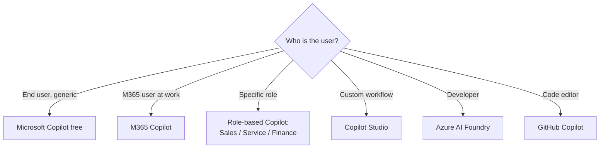

# Domain 2: Microsoft AI Apps and Services

> The Microsoft AI portfolio - what each product is, who uses it, and when to pick which.

## Domain mind map

## The portfolio at a glance

## End-user products

| Product | What it does | Who | License |
|---|---|---|---|
| Microsoft Copilot (free) | Web AI chat with Bing grounding | Anyone | Free |
| Microsoft Copilot Pro | Adds Copilot to consumer Office | Consumer | Subscription |
| Microsoft 365 Copilot | Copilot in Word/Excel/PPT/Outlook/Teams + Microsoft 365 Copilot Chat | Work users | Per-user / month |
| Copilot for Sales | Dynamics 365 Sales / CRM helper | Sellers | Per-user |
| Copilot for Service | Dynamics 365 Customer Service helper | Agents | Per-user |
| Copilot for Finance | Excel + ERP financial helper | Finance teams | Per-user |
| Microsoft 365 Copilot Chat | Web-grounded enterprise chat | Work users (free with M365) | Free with M365 sub |

## Maker product

**Copilot Studio** - low-code platform to build custom Copilot agents:
- **Topics** - conversational flows (similar to bot frameworks).
- **Knowledge** - connect to SharePoint, public web, custom docs.
- **Connectors** - 1500+ pre-built (Power Platform).
- **Agents** - autonomous Copilots that can take actions.
- Publish into M365 Copilot Chat, Teams, web channels.

## Developer / IT pro products

| Service | Use case |
|---|---|
| **Azure AI Foundry** | One-stop platform: model catalog, prompt flow, eval, deploy |
| **Azure OpenAI** | Enterprise-grade access to GPT, embedding, DALL-E in your tenant |
| **Azure AI Search** | Vector + keyword search to ground RAG apps |
| **Azure AI Content Safety** | Filters for unsafe content |
| **Azure AI Document Intelligence** | OCR + form extraction |
| **Azure AI Speech** | Speech-to-text, text-to-speech |
| **Azure AI Vision** | Image analysis + OCR |
| **Azure AI Language** | Sentiment, entity, translation |
| **GitHub Copilot** | IDE code completions + Copilot Chat |

## Picking the right tool

## Build vs. buy

| Use case | Recommendation |
|---|---|
| Generic productivity (drafting, summarizing, email) | **Buy**: M365 Copilot |
| Department-specific Q&A / workflow | **Build with Copilot Studio** (low code) |
| Differentiating customer-facing AI feature | **Build with Azure AI Foundry** (high code) |
| Integration with proprietary models / data | **Build with Azure AI** + custom |
| Global content moderation | **Buy** Azure AI Content Safety |

## Domain 2 cheatsheet

| Wording | Answer |
|---|---|
| "free public web AI" | Microsoft Copilot (free) |
| "AI inside Word/Excel/Outlook for work" | Microsoft 365 Copilot |
| "low-code custom AI agent" | Copilot Studio |
| "build my own AI app for customers" | Azure AI Foundry |
| "AI for sellers in Dynamics 365" | Copilot for Sales |
| "AI for code completion in IDE" | GitHub Copilot |
| "ground my custom data into the model's responses" | Azure AI Search (RAG) or Copilot Studio knowledge |
| "filter unsafe text/image" | Azure AI Content Safety |

---

**Next:** open [03-implementation-strategy.md](03-implementation-strategy.md)
