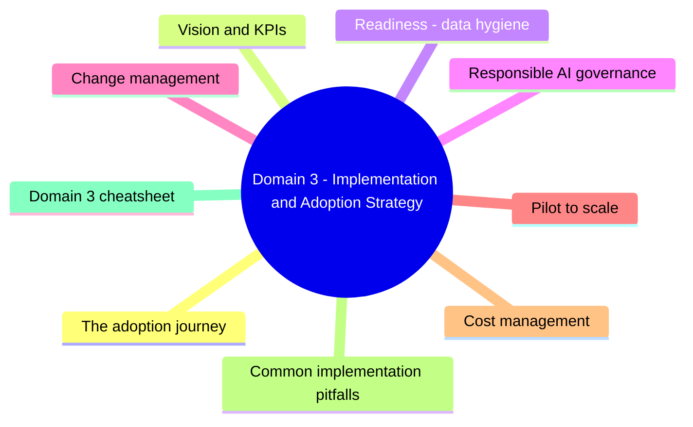
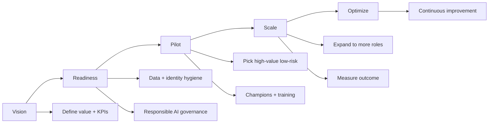
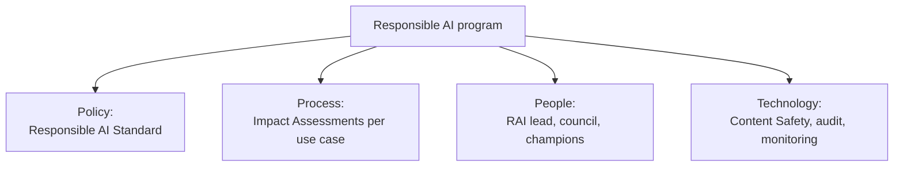
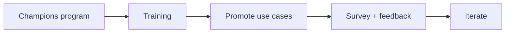

# Domain 3: Implementation and Adoption Strategy

> How to roll out AI in an enterprise: governance, change management, pilot to scale.

## Domain mind map

## The adoption journey

## Vision and KPIs

- One-line vision: "Make every employee 30% more productive on knowledge work in 18 months."
- Each use case has **one** primary KPI (time saved, tickets deflected, revenue lift).
- KPIs roll up to a single executive scorecard.

## Readiness: data hygiene

| Risk | Mitigation |
|---|---|
| **Oversharing in SharePoint** - Copilot exposes private files to employees | SharePoint access reviews + Microsoft Purview sensitivity labels |
| **Stale / duplicate content** | Retention + records management |
| **PII / regulated data leakage** | Purview DLP + sensitivity labels |
| **Tenant-level identity sprawl** | Entra ID hygiene, just-in-time access |

> [!IMPORTANT]
> **Microsoft 365 Copilot Optimization Assessment** - free Microsoft tool to identify oversharing risks before deployment.

## Responsible AI governance

- **Microsoft Responsible AI Standard v2** is a public framework you can adopt.
- Each new AI use case should get an **Impact Assessment** (template on Microsoft Learn).
- Establish an **AI Council** representing legal, security, HR, business.

## Change management

| Tactic | Effect |
|---|---|
| **Champions network** (1 per ~50 users) | Local mentor; faster adoption |
| **Office hours** | Lower friction to ask |
| **Prompt library** (e.g. via Copilot Lab) | Quick wins |
| **Use-case showcase** (internal demo days) | Cross-team learning |
| **Survey monthly** | Measure sentiment + uncover blockers |

## Pilot to scale

| Phase | Duration | Goal |
|---|---|---|
| Pilot | 4-8 weeks | Validate value with 50-300 users |
| Wave 1 | 8-12 weeks | Expand to one full department |
| Wave 2+ | Quarterly | Add departments, refine KPIs |
| Optimize | Continuous | Tune prompts, governance, training |

## Cost management

| Lever | Effect |
|---|---|
| License only roles with proven value | Avoid unused licenses |
| Use Copilot Studio for niche workflows | Lower cost than full M365 Copilot for non-knowledge-workers |
| Azure AI consumption monitoring | Quota + cost alerts in Azure |
| Combine M365 Copilot with Microsoft 365 Copilot Chat (free with M365) | Reach more users at lower cost |

## Common implementation pitfalls

| Pitfall | Fix |
|---|---|
| No KPI | Pick one primary KPI per use case |
| No champions | Establish 1:50 champion ratio before rollout |
| Skipping data hygiene | Purview / SharePoint review BEFORE Copilot turn-on |
| One-shot training | Continuous learning + refreshers |
| Adoption-only measurement | Add productivity + outcome metrics |
| No exit criteria for pilot | Define go/no-go criteria up front |
| No responsible AI program | Run RAI Impact Assessment for each high-risk use case |

## Domain 3 cheatsheet

| Wording | Answer |
|---|---|
| "data leakage when Copilot exposes private files" | Oversharing - fix with SharePoint access review + Purview |
| "metric for AI rollout success" | Productivity / outcome (not just adoption) |
| "risk: regulatory and reputational from biased AI" | Responsible AI governance |
| "before flipping on M365 Copilot" | Data hygiene + identity hygiene + sensitivity labels |
| "official tool to find oversharing risks" | Microsoft 365 Copilot Optimization Assessment |
| "process for evaluating each new AI use case" | Responsible AI Impact Assessment |

---

**Next:** open [05-exam-cheatsheet.md](05-exam-cheatsheet.md)
