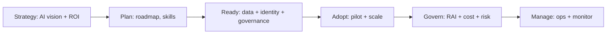

# AB-731 Extra Concepts

> Subtle distinctions and nuances that show up in exam wording for executives.

## "Copilot" disambiguation matrix

| Name | Audience | Build/Buy | Contains |
|---|---|---|---|
| Microsoft Copilot (free) | End user | Buy (free) | Web chat |
| Microsoft Copilot Pro | Consumer | Buy | Office consumer + faster image |
| Microsoft 365 Copilot | Work user | Buy | Office work + Microsoft 365 Copilot Chat |
| Microsoft 365 Copilot Chat | Work user | Buy (free with M365) | Web-grounded chat |
| Copilot for Sales / Service / Finance | Role | Buy | Dynamics 365 + M365 |
| Copilot Studio | Maker | Build | Custom agents |
| Azure AI Foundry | Developer | Build | Models, prompt flow, eval |
| GitHub Copilot | Developer | Buy | IDE code completions |

## Microsoft Copyright Commitment

- Microsoft will **defend customers** against copyright claims arising from Copilot output.
- Conditions: customer must use the built-in content filters and meta-data prompts as recommended.
- Applies to enterprise Copilots (M365 Copilot, GitHub Copilot Business, etc.).

## Customer Commitments

Microsoft's AI Customer Commitments:
1. Sharing knowledge to use AI responsibly.
2. Creating an AI Customer Council.
3. Defending against IP claims (Copyright Commitment).

## Data flow + privacy claims

- M365 Copilot data is processed in your tenant region.
- Data **does NOT** train OpenAI / Microsoft foundation models.
- Customer prompts + responses inherit Purview labels.
- Audit logs available in Microsoft Purview.

## Pricing models

| Product | Pricing |
|---|---|
| Microsoft 365 Copilot | Per user / month |
| Microsoft 365 Copilot Chat | Free with M365 sub (paid for premium features) |
| Copilot Studio | Per message capacity unit |
| Azure OpenAI | PAYG by token + provisioned throughput option (PTU) |
| GitHub Copilot | Per user / month |

## EU AI Act snapshot

- **High-risk AI** systems (credit scoring, recruitment, biometrics) face strict obligations.
- **General-purpose AI** (LLMs) has transparency + content marking obligations.
- Microsoft commits to transparency, content provenance (Content Credentials), and bias testing.

## Where Copilot fits in CAF (Cloud Adoption Framework)

## Image provenance

- **Content Credentials** (C2PA standard) - metadata embedded in Copilot-generated images.
- Helps detect deepfakes and verify legitimate AI output.

---

[Master Index](00-MASTER-INDEX.md)
