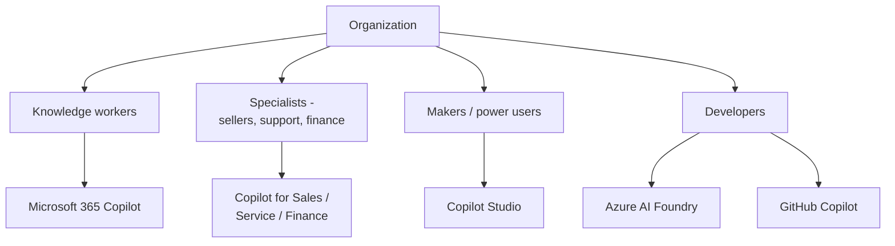
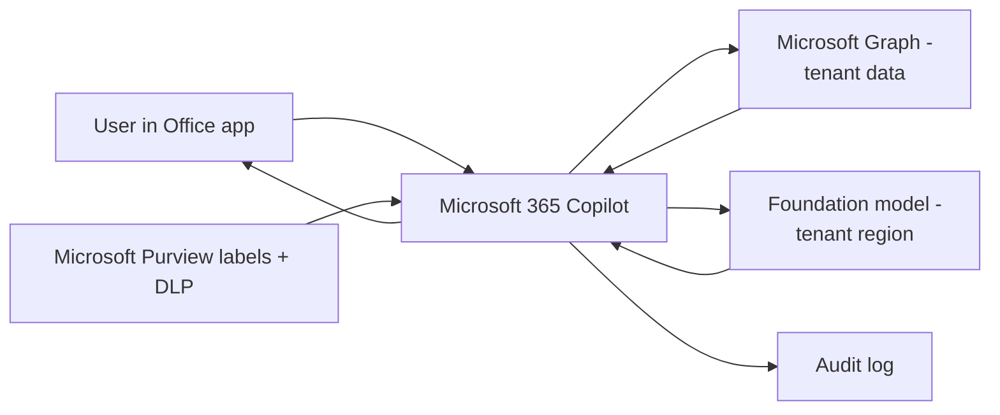
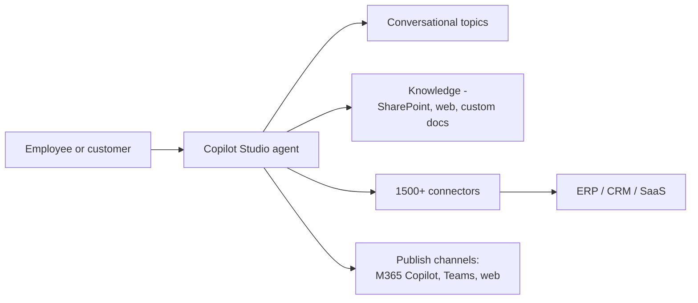
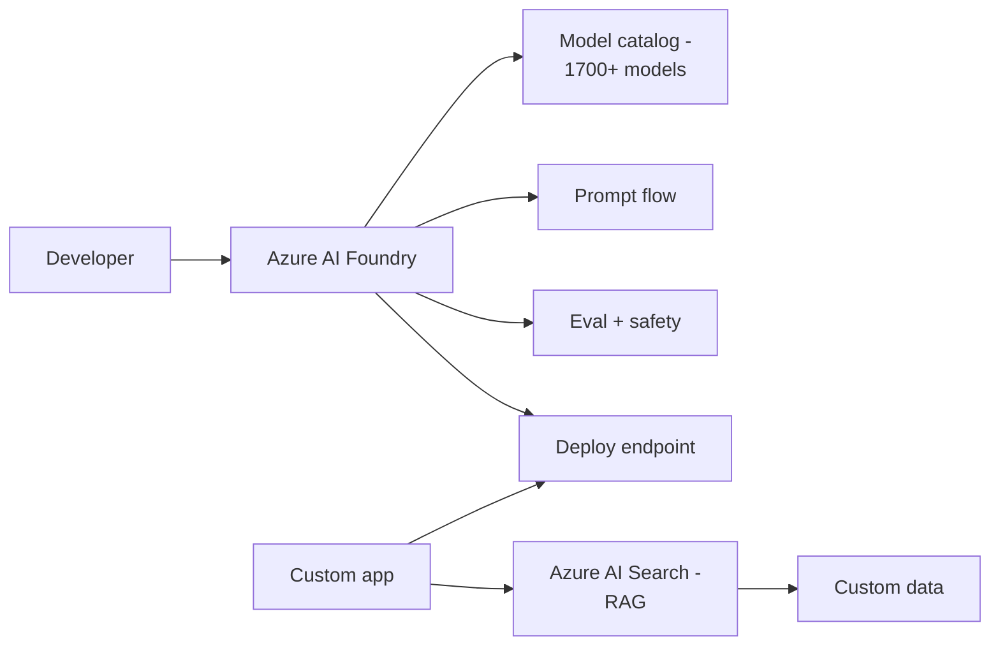
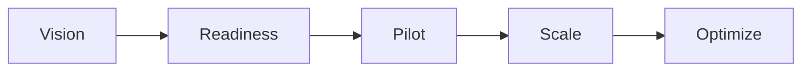
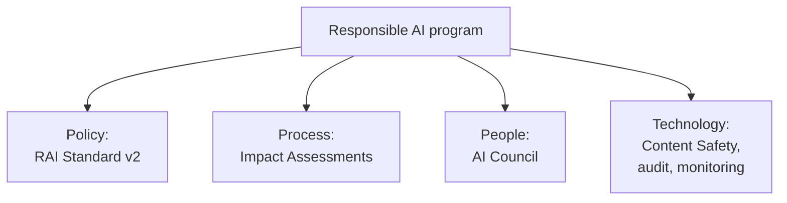

# AB-731 Architectures

> Conceptual architectures relevant to a transformation leader.

## 1. Enterprise AI portfolio map

## 2. Microsoft 365 Copilot data flow

## 3. Custom AI agent (Copilot Studio)

## 4. Custom AI app (Azure AI Foundry)

## 5. Adoption journey

## 6. Responsible AI program

---

[Master Index](00-MASTER-INDEX.md)
